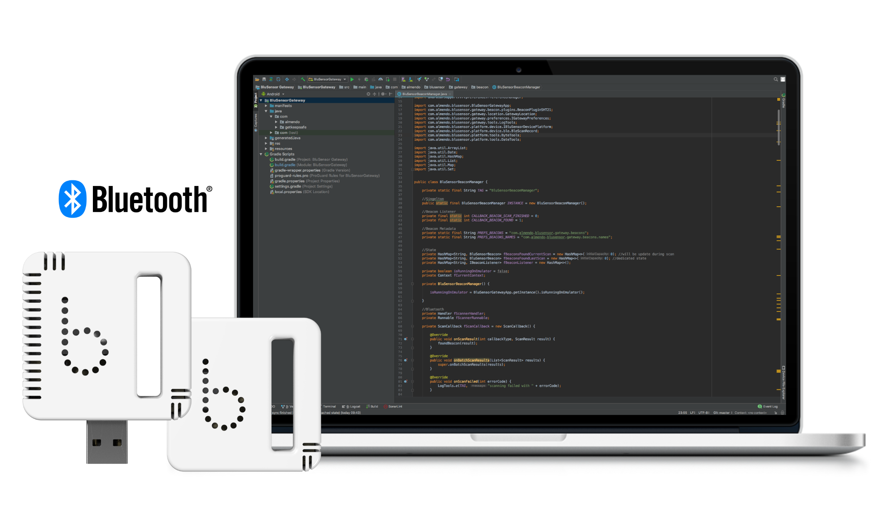

# **bluSensor® Developer**

### Welcome to the official bluSensor® developer repository!

Here, you will find all the necessary information, resources, and guides for integrating and working with bluSensor®
devices. Whether you’re developing with Bluetooth Low Energy (BLE), MQTT, or other protocols, this documentation will
help you get started and provide in-depth knowledge for creating robust applications with our sensors.

## Developer Wiki

All detailed information, including setup guides, technical references, and best practices, can be found in our Wiki.
We are continuously updating this repository with code samples, so make sure to check back regularly for the latest
examples and improvements.

* [bluSensor® Developer Wiki](https://github.com/blusensor/blusensor-developer/wiki)

# Compatible Apps

* [bluSensor® App for iOS](https://itunes.apple.com/at/app/blusensor-air/id1018752395?mt=8)
* [bluSensor® App for Android](https://play.google.com/store/apps/details?id=com.almendo.blusensor.air)

# Purchase Sensors

You can buy sensors and development kits in our online shop at 

* [bluSensor® Shop](https://www.blusensor.com/shop/)
 

# Support

If you’re experiencing issues with the bluSensor® API or need development assistance, our team is here to help! Feel
free to reach out to us anytime at support@blusensor.com for expert support.
